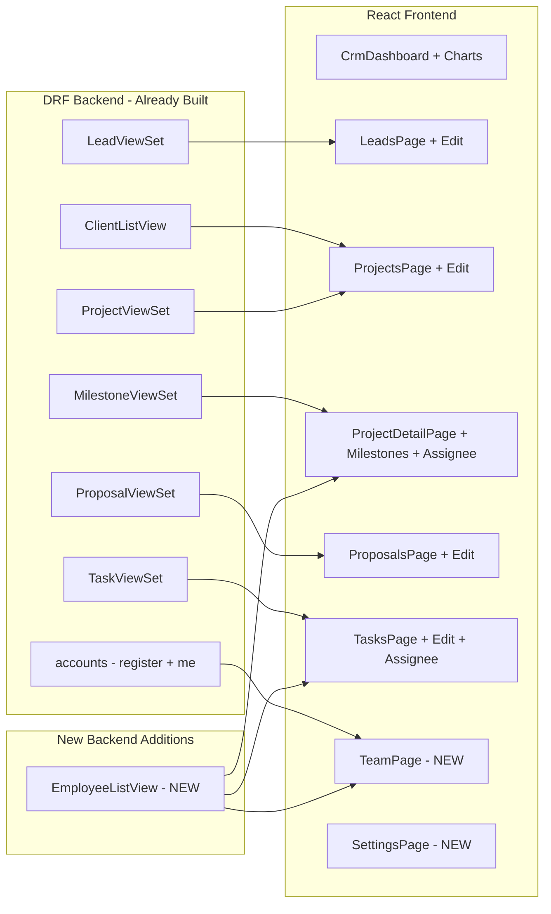

# TechNova CRM — Missing Features Plan

## Context

The core business flow works end-to-end: **Lead → Convert → Proposal → Negotiation → Project → Tasks**.
The backend (DRF ModelViewSets) already supports full CRUD (GET/POST/PUT/PATCH/DELETE) on every entity.
The gaps are almost entirely **frontend UI** plus two small backend additions.

## Architecture Diagram



---

## Phase 1 — Employees Endpoint + Task Assignment

### Why
Tasks have an `assignee` field but no UI to pick who does the work. The serializer already accepts `assignee_email` but there is no endpoint to list employees.

### Backend Changes

**File: `crm/serializers.py`** — Add `EmployeeListSerializer`:
```python
class EmployeeListSerializer(serializers.ModelSerializer):
    email = serializers.CharField(source='user.email', read_only=True)
    full_name = serializers.SerializerMethodField()
    class Meta:
        model = EmployeeProfile
        fields = ['id', 'email', 'full_name', 'department']
    def get_full_name(self, obj):
        return f"{obj.user.first_name} {obj.user.last_name}".strip() or obj.user.email
```

**File: `crm/views.py`** — Add `EmployeeListView`:
```python
class EmployeeListView(generics.ListAPIView):
    serializer_class = EmployeeListSerializer
    permission_classes = [IsAgencyStaff]
    def get_queryset(self):
        return EmployeeProfile.objects.select_related('user').all()
```

**File: `crm/urls.py`** — Add route:
```python
path('employees/', EmployeeListView.as_view(), name='employee-list'),
```

### Frontend Changes

**TasksPage.jsx** — `CreateTaskModal`: fetch `/crm/employees/`, add `<select>` for assignee, send `assignee_email` in POST.
**ProjectDetailPage.jsx** — same for the add-task inline form.
**Task rows** — display `task.assignee` name/email when present.

---

## Phase 2 — Milestone UI in ProjectDetailPage

### Why
`Milestone` model + `MilestoneViewSet` (full CRUD at `/crm/milestones/?project=<id>`) exist but there is no UI.

### Frontend Changes (ProjectDetailPage.jsx only)

1. Add `useApi(\`/crm/milestones/?project=${id}\`)` fetch.
2. Render milestone timeline section (vertical list with due dates + completion checkmarks).
3. "Add Milestone" inline form: title + due_date → `POST /crm/milestones/ { project: id, title, due_date }`.
4. Toggle `is_completed` → `PATCH /crm/milestones/<id>/ { is_completed: !current }`.
5. Delete button → `DELETE /crm/milestones/<id>/`.

No backend changes needed — the ViewSet already handles everything.

---

## Phase 3 — Edit Forms (PATCH support)

### Why
Every entity can be created and deleted but not edited. Backend ModelViewSets already accept PATCH.

### Approach
Each page gets an Edit modal (reusing the existing Create modal structure) that pre-fills fields and sends `PATCH /crm/<entity>/<id>/`.

| Page | Endpoint | Editable Fields |
|------|----------|-----------------|
| LeadsPage | `PATCH /crm/leads/<id>/` | name, email, phone, company, status, message |
| ProjectsPage | `PATCH /crm/projects/<id>/` | title, description, status, start_date, target_end_date |
| ProposalsPage | `PATCH /crm/proposals/<id>/` | title, scope, proposed_budget, dates, technologies |
| TasksPage | `PATCH /crm/tasks/<id>/` | title, priority, status, due_date, assignee_email |

### Pattern
```jsx
// Reusable edit-modal pattern per page
const [editing, setEditing] = useState(null);
// Edit button on each row opens modal with pre-filled data
// Submit calls api.patch(`/crm/${entity}/${editing.id}/`, form)
```

---

## Phase 4 — Team/Employees Management Page

### Why
Staff members can only be created via Django admin or API directly. CRM needs a management page.

### Frontend Changes

**New file: `frontend/src/pages/crm/TeamPage.jsx`**
- List all employees from `/crm/employees/` (built in Phase 1).
- "Add Team Member" form: first_name, last_name, email, password, department → `POST /api/v1/auth/register/` then `PATCH` employee profile for department.
- Delete employee (deactivate) — backend needs a soft-delete or status field (out of scope, can use Django admin for now or add `is_active` toggle).

**CrmLayout.jsx** — Add nav item:
```js
{ to: "/admin/team", label: "Team", icon: Users }
```

**App.jsx** — Add route:
```jsx
<Route path="/admin/team" element={<TeamPage />} />
```

---

## Phase 5 — Dashboard Charts & Search

### Dashboard Charts (CrmDashboard.jsx)

Add visual analytics using lightweight inline SVG/CSS bars (no heavy dependency) or `recharts`:
- **Proposal pipeline funnel**: Draft → Sent → Negotiating → Accepted → Rejected (horizontal bars).
- **Task status distribution**: Todo / In Progress / Review / Done (donut or stacked bar).
- **Project status breakdown**: Not Started / In Progress / On Hold / Completed.

### Search Bars
- Add a text input to LeadsPage, ProjectsPage, TasksPage.
- Filter client-side on `name`/`title`/`email` or send `?search=` param (DRF SearchFilter already configured on leads and tasks).

### Pagination (Optional)
- Simple "Load More" button or page numbers.
- Backend can add DRF pagination in `settings.py` `REST_FRAMEWORK` config if needed.

---

## Phase 6 — Polish & Settings

### SettingsPage.jsx
- Current user profile edit (first_name, last_name).
- Password change form.
- Agency branding (read-only for now, or stored in a simple KV model).

### In-App Notification Bell (Optional)
- Poll `/crm/leads/?status=new` count + proposals with `status=sent` needing response.
- Display unread count badge in AppShell header.

---

## Priority Summary

| Phase | Impact | Effort |
|-------|--------|--------|
| 1. Task Assignment | High — core PM feature | Low — 1 endpoint + dropdowns |
| 2. Milestone UI | High — project tracking | Low — frontend only |
| 3. Edit Forms | Critical — usability | Medium — 4 modals |
| 4. Team Page | Medium — admin control | Medium — new page |
| 5. Dashboard Charts | Medium — polish/insight | Medium — chart components |
| 6. Settings/Notifications | Low — nice-to-have | Low-Medium |

**Recommended build order: 1 → 2 → 3 → 4 → 5 → 6**
