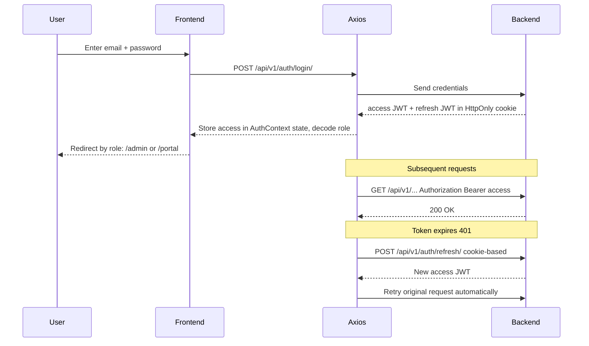

# TechNova CRM — Frontend Architecture Plan

> **Stack:** React 19 · Vite · Tailwind CSS v4 · shadcn/ui · React Router 7 · Axios · Framer Motion 12
> **Design paradigm:** "Slate & Cyber Indigo" — see [`design.md`](crm_project/design.md)
> **Hosting:** Frontend → Vercel · Backend → Render · Separate git repos in one folder

---

## 1. Three Surface Areas

| Surface | Theme | Routes | Users |
|---------|-------|--------|-------|
| **Public Website** | Dark `#0f172a`, cinematic, scroll-animation showcase, robot mascot | `/`, `/services`, `/case-studies`, `/team`, `/contact` | Anonymous visitors |
| **CRM Dashboard** | Light canvas + dark sidebar `#0f172a` | `/admin/*` | Staff (employees + admins) |
| **Client Portal** | Light canvas + dark sidebar | `/portal/*` | Clients |

---

## 2. Scroll Animation System — "Kinetic Reveal Engine"

Every section on the public website enters the viewport with a **different** animation. This is the signature visual identity. A dedicated library of reusable Framer Motion animation variants ensures variety without code duplication.

### 2.1 Animation Variant Library

`src/lib/animations.js` exports a set of named variants. Each public section picks a different one:

| Variant Name | What Happens | Best For |
|--------------|-------------|----------|
| `fadeUp` | Opacity 0→1, translateY 40→0 | Default text blocks |
| `fadeDown` | Opacity 0→1, translateY -40→0 | Headers from top |
| `slideLeft` | translateX 80→0 + fade | Right-aligned content |
| `slideRight` | translateX -80→0 + fade | Left-aligned content |
| `scaleIn` | scale 0.8→1 + opacity | Images, hero visuals |
| `flipUp` | rotateX 90→0 + perspective | Cards, bento grid items |
| `blurIn` | filter blur(12px)→blur(0) + opacity | Dramatic hero text |
| `stagger` | Children reveal sequentially (0.15s each) | Lists, grids |
| `clipReveal` | clip-path inset(100% 0 0 0)→inset(0) | Full-width banners |
| `elasticPop` | scale 0→1 with spring bounce | Badges, icons |
| `typingReveal` | Characters appear one by one | Section subtitles |

### 2.2 Reusable Component — `<Reveal>`

```jsx
// src/components/common/Reveal.jsx
// Usage: <Reveal variant="flipUp" delay={0.2}>...</Reveal>
// Wraps children in motion.div with the selected variant
// Uses viewport={{ once: true, margin: "-80px" }} per design.md
```

- Props: `variant` (string), `delay` (number), `className`, `as` (element type)
- Reads variant from `animations.js` map
- All variants share the custom easing curve: `[0.215, 0.610, 0.355, 1.000]`

### 2.3 Section-by-Section Animation Map

Each public page section uses a **deliberately different** animation so scrolling feels dynamic:

**HomePage sections:**
| Section | Animation | Detail |
|---------|-----------|--------|
| Hero headline | `blurIn` | Dramatic blur-to-sharp reveal |
| Hero subtitle | `typingReveal` | Typewriter effect |
| Hero CTA buttons | `elasticPop` | Spring-bounce in sequence |
| Services preview cards | `stagger` + `flipUp` | Each card flips up with 0.15s delay |
| Stats counter | `scaleIn` + count-up | Numbers animate from 0 |
| Case studies preview | `slideLeft` / `slideRight` | Alternating directions |
| Testimonials | `fadeUp` carousel | Cards fade up on scroll |
| Final CTA banner | `clipReveal` | Wipes in from bottom |
| Footer | `fadeDown` | Slides from top |

**Other pages:** Each picks different combos so no two pages feel identical.

### 2.4 Parallax Layers

- Background gradient orbs move at different scroll speeds (`useScroll` + `useTransform`)
- Decorative grid lines shift horizontally on scroll
- Section dividers (SVG waves) morph as you pass them

---

## 3. Robot Mascot — "NovaBot"

An SVG-based robot companion that lives on the **public website only**. It follows the user's scroll, points to sections, and gives contextual speech-bubble tips.

### 3.1 Design

- **SVG component**: `<NovaBot />` — friendly geometric robot (rounded indigo body, glowing sky-400 eyes, antenna with pulse, small articulated arms)
- **Color**: indigo-600 body, sky-400 glowing eyes, white accents — matches brand palette
- **Size**: ~120px tall, `fixed` positioned bottom-right on desktop, hidden on mobile (`hidden lg:block`)

### 3.2 Behaviors (Framer Motion)

| Trigger | Animation |
|---------|-----------|
| **Scroll** | Robot's Y position smoothly tracks `useScroll` progress via `useTransform` — it "rides" alongside the user |
| **Section enter** | Each `<section data-mascot-tip="...">` triggers a speech bubble via IntersectionObserver; bubble auto-dismisses after 4s |
| **Idle** | Subtle floating loop `animate={{ y: [0, -8, 0] }}` + periodic blink (eyes scaleY 1→0.1→1) |
| **Hover** | Robot waves (arm rotates 0→30→0), eyes scale up |
| **CTA hover** | When user hovers a button, NovaBot rotates to point at it |
| **Page bottom** | NovaBot does a celebratory spin when user reaches footer |

### 3.3 Component Architecture

```
src/components/mascot/
├── NovaBot.jsx              # Main SVG robot + motion wrapper
├── SpeechBubble.jsx         # Animated speech bubble with AnimatePresence
├── useMascotScroll.js       # Hook: useScroll + useTransform → y position
├── useMascotTips.js         # Hook: IntersectionObserver for data-mascot-tip
└── mascotData.js            # Section → tip text mapping
```

### 3.4 Integration

- `<NovaBot />` rendered once inside `PublicLayout`, `fixed bottom-6 right-6 z-50`
- Each public page section carries `data-mascot-tip="Hello there!"` attribute
- `useMascotScroll` uses Framer Motion's `useScroll()` + `useTransform(scrollYProgress, [0,1], [0, maxOffset])`
- Speech bubble uses `<AnimatePresence>` for smooth enter/exit

---

## 4. Directory Structure

```
frontend/src/
├── main.jsx                     # Entry: BrowserRouter + AuthProvider
├── App.jsx                      # Top-level route definitions
├── index.css                    # Tailwind v4 @import + @theme tokens + fonts
│
├── lib/
│   ├── api.js                   # Axios instance + JWT interceptors
│   ├── auth.jsx                 # AuthContext + useAuth hook
│   ├── animations.js            # Framer Motion variant library (Kinetic Reveal Engine)
│   └── utils.js                 # cn() helper for shadcn/ui
│
├── components/
│   ├── ui/                      # shadcn/ui components (Button, Card, Input, etc.)
│   ├── mascot/                  # NovaBot robot mascot (public only)
│   │   ├── NovaBot.jsx
│   │   ├── SpeechBubble.jsx
│   │   ├── useMascotScroll.js
│   │   ├── useMascotTips.js
│   │   └── mascotData.js
│   ├── common/
│   │   ├── Reveal.jsx           # Universal scroll-reveal wrapper
│   │   ├── ProtectedRoute.jsx   # Role-based route guard
│   │   ├── Spinner.jsx
│   │   └── EmptyState.jsx
│   ├── layouts/
│   │   ├── PublicLayout.jsx     # Dark navbar + NovaBot + parallax bg + footer
│   │   ├── CrmLayout.jsx        # Dark sidebar + light content area
│   │   └── PortalLayout.jsx     # Dark sidebar + light content area
│   └── public/                  # Public site sections
│       ├── Navbar.jsx
│       ├── Hero.jsx
│       ├── ServicesSection.jsx
│       ├── CaseStudiesSection.jsx
│       ├── TestimonialsSection.jsx
│       ├── TeamSection.jsx
│       ├── ContactSection.jsx
│       ├── StatsCounter.jsx
│       ├── ParallaxBackground.jsx
│       └── Footer.jsx
│
├── pages/
│   ├── public/
│   │   ├── HomePage.jsx
│   │   ├── ServicesPage.jsx
│   │   ├── CaseStudiesPage.jsx
│   │   ├── CaseStudyDetailPage.jsx
│   │   ├── TeamPage.jsx
│   │   ├── ContactPage.jsx
│   │   └── LoginPage.jsx        # Shared login, redirects by role
│   ├── crm/
│   │   ├── CrmDashboard.jsx
│   │   ├── LeadsPage.jsx
│   │   ├── LeadDetailPage.jsx
│   │   ├── ProjectsPage.jsx
│   │   ├── ProjectDetailPage.jsx
│   │   ├── ProposalsPage.jsx
│   │   ├── ProposalDetailPage.jsx
│   │   └── TasksPage.jsx
│   └── portal/
│       ├── PortalDashboard.jsx
│       ├── PortalProposalsPage.jsx
│       ├── PortalProposalDetailPage.jsx
│       └── PortalProjectsPage.jsx
│
└── hooks/
    └── useApi.js                # Generic fetch hook (loading/error/data)
```

---

## 5. Routing Map

```mermaid
flowchart TD
    A["Router"] --> B["PublicLayout"]
    A --> C["CrmLayout ProtectedRoute role=staff"]
    A --> D["PortalLayout ProtectedRoute role=client"]

    B --> B1[" /  HomePage"]
    B --> B2[" /services  ServicesPage"]
    B --> B3[" /case-studies  CaseStudiesPage"]
    B --> B4[" /case-studies/:slug  CaseStudyDetailPage"]
    B --> B5[" /team  TeamPage"]
    B --> B6[" /contact  ContactPage"]
    B --> B7[" /login  LoginPage"]

    C --> C1[" /admin/dashboard  Dashboard"]
    C --> C2[" /admin/leads  LeadsPage"]
    C --> C3[" /admin/leads/:id  LeadDetailPage"]
    C --> C4[" /admin/projects  ProjectsPage"]
    C --> C5[" /admin/projects/:id  ProjectDetailPage"]
    C --> C6[" /admin/proposals  ProposalsPage"]
    C --> C7[" /admin/proposals/:id  ProposalDetailPage"]
    C --> C8[" /admin/tasks  TasksPage"]

    D --> D1[" /portal/dashboard  PortalDashboard"]
    D --> D2[" /portal/proposals  PortalProposalsPage"]
    D --> D3[" /portal/proposals/:id  PortalProposalDetailPage"]
    D --> D4[" /portal/projects  PortalProjectsPage"]
```



---

## 6. API Surface Map

All requests go through `/api/v1/` (Vite proxy in dev, Vercel rewrite in prod).

| Domain | Endpoint | Method | Auth |
|--------|----------|--------|------|
| **Auth** | `/api/v1/auth/login/` | POST | Public |
| | `/api/v1/auth/refresh/` | POST | Cookie |
| | `/api/v1/auth/me/` | GET | JWT |
| | `/api/v1/auth/register/` | POST | Admin |
| **Public** | `/api/v1/public/leads/` | POST | Public |
| **Marketing** | `/api/v1/marketing/services/` | GET | Public |
| | `/api/v1/marketing/services/:slug/` | GET | Public |
| | `/api/v1/marketing/testimonials/` | GET | Public |
| | `/api/v1/marketing/case-studies/` | GET | Public |
| | `/api/v1/marketing/case-studies/:slug/` | GET | Public |
| | `/api/v1/marketing/team/` | GET | Public |
| **CRM** | `/api/v1/crm/leads/` | GET/POST | Staff |
| | `/api/v1/crm/leads/:id/convert/` | POST | Staff |
| | `/api/v1/crm/proposals/` | GET/POST | Staff |
| | `/api/v1/crm/proposals/:id/send/` | POST | Staff |
| | `/api/v1/crm/proposals/:id/accept/` | POST | Staff |
| | `/api/v1/crm/proposals/:id/negotiate/` | POST | Staff |
| | `/api/v1/crm/proposals/:id/reject/` | POST | Staff |
| | `/api/v1/crm/proposals/:id/messages/` | GET/POST | Staff |
| | `/api/v1/crm/proposals/:id/messages/:msgId/accept_counter/` | POST | Staff |
| | `/api/v1/crm/projects/` | GET/POST | Staff |
| | `/api/v1/crm/tasks/` | GET/POST | Staff |
| | `/api/v1/crm/milestones/` | GET/POST | Staff |
| **Portal** | `/api/v1/portal/proposals/` | GET | Client |
| | `/api/v1/portal/proposals/:id/accept/` | POST | Client |
| | `/api/v1/portal/proposals/:id/negotiate/` | POST | Client |
| | `/api/v1/portal/proposals/:id/reject/` | POST | Client |
| | `/api/v1/portal/proposals/:id/messages/` | GET/POST | Client |
| | `/api/v1/portal/proposals/:id/messages/:msgId/accept_counter/` | POST | Client |
| | `/api/v1/portal/projects/` | GET | Client |

---

## 7. Design System — Tailwind v4 Tokens

```css
/* src/index.css */
@import "tailwindcss";

@theme {
  --color-brand-dark: #0f172a;      /* slate-900 — public bg, sidebars */
  --color-brand-elevated: #1e293b;  /* slate-800 — dark cards */
  --color-brand-light: #f8fafc;     /* slate-50 — CRM/portal bg */
  --color-brand-surface: #ffffff;   /* white — light cards */
  --color-brand-primary: #4f46e5;   /* indigo-600 — CTAs */
  --color-brand-accent: #38bdf8;    /* sky-400 — highlights */
  --color-brand-success: #10b981;   /* emerald-500 */
  --color-brand-caution: #f59e0b;   /* amber-500 */
  --color-brand-alert: #f43f5e;     /* rose-500 */

  --font-heading: "Plus Jakarta Sans", sans-serif;
  --font-body: "Inter", sans-serif;
}
```

Google Fonts loaded via `index.html` `<link>` tags.

---

## 8. Auth Flow



- Access token stored in `AuthContext` state (in-memory)
- Refresh token in HttpOnly cookie (backend sets, frontend never touches)
- Axios response interceptor: catches 401 → calls `/api/v1/auth/refresh/` → retries original request
- `ProtectedRoute` checks auth state + role → redirects to `/login` if unauthorized

---

## 9. Implementation Phases

### Phase F0 — Foundation Setup
- [ ] Replace `src/index.css` with Tailwind v4 `@theme` tokens + Google Fonts import
- [ ] Initialize shadcn/ui (`npx shadcn@latest init`) + add core components (Button, Card, Input, Dialog, Badge, Table, Toast/Sonner)
- [ ] Create `lib/utils.js` (`cn` helper)
- [ ] Create `lib/animations.js` — the Kinetic Reveal Engine variant library (fadeUp, slideLeft, scaleIn, flipUp, blurIn, clipReveal, elasticPop, stagger, etc.)
- [ ] Create `lib/api.js` — Axios instance with JWT interceptor (request: attach Bearer; response: 401 → refresh → retry)
- [ ] Create `lib/auth.jsx` — `AuthContext` with `login()`, `logout()`, `user`, `loading`
- [ ] Create `components/common/Reveal.jsx` — universal scroll-reveal wrapper
- [ ] Create `components/common/ProtectedRoute.jsx` — role-based guard
- [ ] Wire up `App.jsx` with React Router routes (all 3 layouts)
- [ ] Clean up default Vite template (App.css, default assets)

### Phase F1 — Public Layout + Robot Mascot + Animation Engine
- [ ] Build `PublicLayout.jsx` — dark navbar (transparent→blur on scroll), parallax background orbs, footer
- [ ] Build `ParallaxBackground.jsx` — gradient orbs + grid that shift on scroll
- [ ] Build `NovaBot.jsx` — SVG robot with idle float + blink
- [ ] Build `useMascotScroll.js` — scroll-following Y position
- [ ] Build `useMascotTips.js` — IntersectionObserver for section tips
- [ ] Build `SpeechBubble.jsx` — AnimatePresence-driven tips
- [ ] Build `mascotData.js` — section→tip mapping

### Phase F2 — Public Website Pages (Animation Showcase)
- [ ] `HomePage.jsx` — full landing page with varied per-section animations
  - Hero: blurIn + typingReveal + elasticPop CTAs
  - Services preview: stagger + flipUp cards
  - Stats counter: scaleIn + count-up
  - Case studies preview: alternating slideLeft/slideRight
  - Testimonials: fadeUp carousel
  - Final CTA: clipReveal
- [ ] `ServicesPage.jsx` — full grid from `/api/v1/marketing/services/`
- [ ] `CaseStudiesPage.jsx` + `CaseStudyDetailPage.jsx` — from `/api/v1/marketing/case-studies/`
- [ ] `TeamPage.jsx` — from `/api/v1/marketing/team/`
- [ ] `ContactPage.jsx` — form POST to `/api/v1/public/leads/`

### Phase F3 — Auth + CRM Layout
- [ ] `LoginPage.jsx` — shared login, decodes JWT role, redirects to `/admin` or `/portal`
- [ ] `CrmLayout.jsx` — dark sidebar (`w-64`) + light content area
- [ ] CRM sidebar nav: Dashboard, Leads, Projects, Proposals, Tasks

### Phase F4 — CRM Dashboard + Leads
- [ ] `CrmDashboard.jsx` — stat cards (total leads, active projects, pending proposals, open tasks)
- [ ] `LeadsPage.jsx` — table with status badges, filter, search
- [ ] `LeadDetailPage.jsx` — full lead info + "Convert to Client" action

### Phase F5 — CRM Projects + Tasks
- [ ] `ProjectsPage.jsx` — project cards/table
- [ ] `ProjectDetailPage.jsx` — milestones, tasks, status timeline
- [ ] `TasksPage.jsx` — task board with priority/status badges

### Phase F6 — CRM Proposals + Negotiation
- [ ] `ProposalsPage.jsx` — list of proposals with status badges
- [ ] `ProposalDetailPage.jsx` — proposal details + negotiation message thread
- [ ] Accept / Negotiate (counter-offer form) / Reject (reason message) actions
- [ ] Counter-offer merge visualization

### Phase F7 — Client Portal
- [ ] `PortalLayout.jsx` — dark sidebar + light content
- [ ] `PortalDashboard.jsx` — client's active projects + pending proposals
- [ ] `PortalProposalsPage.jsx` + `PortalProposalDetailPage.jsx` — accept/negotiate/reject UI
- [ ] `PortalProjectsPage.jsx` — view milestones/tasks (read-only)

### Phase F8 — Polish + Deploy
- [ ] Loading states (spinners, skeleton screens)
- [ ] Error handling (toast notifications via shadcn/ui Sonner)
- [ ] Responsive design pass (mobile/tablet breakpoints; NovaBot hidden on mobile)
- [ ] SEO meta tags for public pages
- [ ] Vercel deployment config (`vercel.json` rewrites `/api/*` → Render backend URL)
- [ ] Initialize separate git repo for `frontend/` directory
